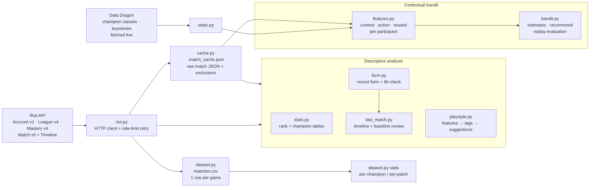
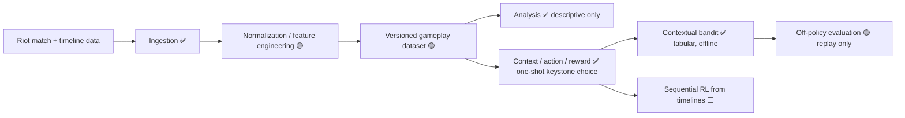

# RiftLab

RiftLab is an experimental project that uses League of Legends ranked-match data to study decision-making: which choices line up with better outcomes, and whether learning-based methods can find better ones. Today it's a small set of Python CLI tools. They pull match data from the Riot API, build a local dataset of my ranked games, compute per-game and per-player features, run descriptive analysis, and learn a contextual bandit for keystone rune choice offline from about 3,000 logged player decisions. It's a research playground, not a finished product, and the bandit's first evaluation shows no measurable edge yet.

## Motivation

League of Legends makes you decide under uncertainty all the time: which champion to play, which runes to take into a given team composition, when to fight, and when to stop queuing. Sites like op.gg show aggregate stats, but they don't answer questions about *my* decisions in *my* games.

RiftLab started as a personal stats tracker for my BR ranked games. It's now a place to try out:

- turning raw match data into a dataset I can reason about,
- measuring individual games against baselines instead of global averages,
- framing a choice as a learning problem (context → action → reward) and evaluating it honestly with small, noisy, observational data.

**What RiftLab is not:** it's not a bot, and it doesn't play the game or interact with the game client. It only reads data from Riot's public APIs, and every output is text for a human to read.

## What RiftLab explores

| Area | Status | Where |
|---|---|---|
| Data ingestion from the Riot API (Account, League, Mastery, Match v5, Timeline) | **Implemented** | `riot.py`, `cache.py`, `ingest/dataset.py` |
| Local gameplay dataset (CSV) with incremental fetching | **Implemented** | `ingest/dataset.py` → `matches.csv` |
| Per-game feature engineering (KP, damage share, CS/min, death timing, etc.) | **Implemented** | `analysis/playstyle.py`, `analysis/last_match.py`, `ingest/dataset.py` |
| Descriptive analysis (per-champion, per-patch, playstyle tags, personal baselines) | **Implemented** | `analysis/stats.py`, `analysis/playstyle.py`, `analysis/last_match.py`, `ingest/dataset.py stats` |
| Recent form and a tilt heuristic | **Implemented** | `analysis/form.py` |
| Team-composition representation (from public champion data) | **Implemented**, deliberately coarse | `rl/features.py` |
| Contextual bandit for keystone choice, learned offline, with replay evaluation | **Implemented, experimental** (no measurable edge yet) | `rl/bandit.py` |
| Sequential RL (MDP, environment, policy learning) | **Not implemented** (research direction) | — |
| Predictive models (e.g. win probability) | **Not implemented** (research direction) | — |

## Architecture

### Current architecture

Everything is one Python package (`src/riftlab/`) of small CLI modules that share one HTTP client (`riot._get`, which retries on HTTP 429). Persistence is plain files: CSV and JSON. There's no database and no service.



Module roles:

- **`riot.py`**: account and region config (from `accounts.json`) and the Riot API wrappers.
- **`paths.py`**: project-root-relative locations for every local file (config, dataset, cache), so the tools behave the same from any directory.
- **`cache.py`**: caches raw match JSON locally so repeated runs don't hit the API again. Also stores a manual *exclusion* list for games you want to drop from analysis (trolls, AFKs), which is a simple way to handle outliers.
- **`ingest/dataset.py`**: incrementally fetches all available ranked Solo/Duo games per account into `matches.csv`, one row per (match, player), and prints per-champion and per-patch summaries.
- **`analysis/stats.py`**: rank and per-champion overview of the last 20 games.
- **`analysis/playstyle.py`**: feature extraction over recent games, threshold-based playstyle tags, and mastery-weighted champion suggestions.
- **`analysis/last_match.py`**: review of the last ranked game using its timeline, compared against a personal baseline.
- **`analysis/form.py`**: recent form and the tilt heuristic (shown after the last-match review).
- **`rl/static.py`**: champion classes, attack/magic ratings and keystone names from Data Dragon.
- **`rl/features.py`**: turns a cached match into one (context, action, reward) sample per participant.
- **`rl/bandit.py`**: the bandit model, its CLI, and the replay evaluation (see [Reinforcement learning](#reinforcement-learning)).

### Project layout

```text
src/riftlab/
├── riot.py              # Riot API client + account config
├── paths.py             # project-root-relative locations of local files
├── cache.py             # raw match JSON cache + exclusions
├── ingest/
│   └── dataset.py       # builds matches.csv
├── analysis/            # stats.py, playstyle.py, last_match.py, form.py
└── rl/                  # static.py, features.py, bandit.py
tests/                   # unit tests for the bandit's context, reward and estimates
pyproject.toml, uv.lock  # dependencies, managed with uv
Makefile                 # shortcuts for the common commands
accounts.example.json    # template for the local, gitignored accounts.json
```

Every module can be run with `uv run python -m riftlab.<module>` (e.g. `riftlab.analysis.playstyle main`), and the Makefile wraps the common ones.

### Planned architecture / research direction

This is where the project is headed, **not all of it exists today**:



✅ implemented · 🟡 partial · ⬜ not started

## Data / Features

### Sources

- **Riot API** (needs a personal API key): account lookup, ranked entries, champion mastery, match history (queue 420, ranked Solo/Duo), per-match detail, and per-match timeline (frame-by-frame events).
- **Data Dragon** (public CDN, no key), fetched at runtime: champion classes (`tags`) and attack/magic ratings, keystone names, and champion names for mastery.

### Dataset (generated locally, not committed)

`matches.csv` is built by `ingest/dataset.py` and is gitignored, because it contains Riot API data and player IDs, so every user regenerates their own. The first snapshot (April 2026, when the project still tracked two accounts) had:

- 1,038 ranked Solo/Duo games (859 on the account now tracked as `main`, 179 on a second account that's no longer tracked), from 2024-10-07 to 2026-04-27, across 127 champions.
- Columns: `match_id, account, puuid, champion, win, kills, deaths, assists, cs, damage, vision, kp, duration_min, timestamp, patch, queue`, plus `double/triple/quadra/penta_kills` on newer rows.
- Games under 5 minutes (remakes) are dropped.

The bandit learns from a different local source: the raw match cache (`.match_cache.json`), which stores full match payloads with all 10 players' champions, keystones and stats. See [Reinforcement learning](#reinforcement-learning).

### Features currently extracted

| Level | Features | Code |
|---|---|---|
| Per game (player) | KDA, CS and CS/min, damage to champions, vision score, kill participation, damage share of team, magic/physical damage ratio, gold/min, damage/min, CC time, objective damage, solo kills, "saved ally", first blood, patch | `playstyle.extract_rich`, `dataset._fetch_one` |
| Per game (timeline) | death timestamps bucketed into early (≤14 min), mid (15–24 min) and late game; CS at 10 min | `analysis/last_match.py` |
| Per player (aggregate) | averages of the above, role distribution, champion diversity, win rate, mastery-weighted champion affinity | `playstyle.compute_profile` |
| Personal baseline | average deaths, KP, vision, CS/min and control wards over the last ~10 games; each game is compared against it | `last_match.build_baseline` |
| Recent form | last-5 win rate, deaths and KP, skipping excluded games; a rule-based "tilt" check | `analysis/form.py` |
| Team composition (per participant) | five flags from both teams' Data Dragon classes and ratings (see below) | `rl/features.py` |

### Analysis performed

- per-champion and per-patch win rate, KDA, CS, damage and multikills (`ingest/dataset.py stats`, `analysis/stats.py`)
- threshold-based playstyle tags (e.g. `carry`, `vision-focused`, `high-risk`) and champion suggestions from tag overlap plus mastery (`analysis/playstyle.py`)
- single-game review against personal baselines, with rule-generated notes, followed by the tilt check (`analysis/last_match.py`)
- keystone estimates per champion and matchup, and a chronological replay evaluation (`rl/bandit.py`)

## Reinforcement learning

### Problem framing

The question is: *given my champion and both team compositions, which keystone rune tends to lead to better outcomes?* The choice is made once, before the game, and its payoff arrives at the end, so this is a **contextual bandit**, not full RL: there's no sequence of states, and the choice doesn't change what the next decision will be. Sequential RL would only make sense for in-game decisions, which is a research direction below.

### Formulation (as implemented)

| Concept | Implementation |
|---|---|
| **Context / state** | Five binary flags from the player's point of view, built from the Data Dragon classes and attack/magic ratings of all 10 champions: `enemy_ap_heavy` (3+ enemies rated more magic than attack), `enemy_ad_heavy` (the reverse), `enemy_assassin`, `enemy_tanky` (2+ enemies whose primary class is Tank), `ally_no_frontline` (no Tank/Fighter teammate). Up to 32 contexts; estimates are kept separately per champion. |
| **Action** | The keystone rune the player took (17 possible). |
| **Reward** | `(±1 for win/loss + clip(0.1 × (teammates' mean deaths − deaths), ±0.25) + clip(0.5 × (KP − teammates' mean KP), ±0.25)) / 1.5`, so it lies in [-1, 1]. Deaths and KP are measured against teammates in the same game, so it needs no player history and can't leak future games. |
| **Environment** | None live. Learning is **offline** from logged games: every participant of every cached ranked match is one sample. That includes players from my games and from my teammates' and opponents' recent games, which pools decisions across thousands of players instead of just mine. Remakes (< 10 min) and manually excluded matches are skipped. |
| **Learning** | Tabular estimate per (champion, context, keystone): mean reward shrunk toward 0 by 2 pseudo-games, so one lucky game can't dominate. If a context has fewer than 10 games for that champion, the champion-level estimate is used instead. The model is rebuilt from the cache on every run, so the same cache always gives the same result. |
| **Policy** | `recommend` ranks keystones for a champion and matchup. The greedy choice needs at least 5 games behind it; `--explore` ranks by UCB1 instead, favoring keystones that have been tried less. Nothing acts on it automatically: the output is for a human to read. |
| **Evaluation** | `evaluate` replays matches in time order: before each match, the model (trained only on earlier matches) makes its greedy recommendation for every participant, then learns from the match. It compares outcomes for players whose keystone matched the recommendation against those whose didn't. |

### Results on the current cache

From `make rl-summary` and `make rl-evaluate` on the April 2026 cache snapshot (317 cached matches). The cache is being rebuilt, so re-running will give different numbers:

| | |
|---|---|
| Usable matches / samples | 303 matches → 3,030 player-games, 2,619 players, 172 champions |
| Contexts seen | 22 of 32 |
| (champion, keystone) estimates | 496, of which 188 have ≥ 5 games |
| Replay coverage | a recommendation existed for 1,939 samples (64%) |
| Took the recommended keystone | 1,199 (62% of covered) |
| Mean reward: took it / didn't | +0.011 (51% WR) / +0.029 (52% WR) |
| Difference (95% CI) | −0.018 [−0.081, +0.044] |

**Interpretation:** there's no detectable difference. The interval includes zero, and it's optimistic, because the 10 samples from one match are correlated. Even a positive difference wouldn't be causal: these are observational choices made by players, not by the bandit. So the honest conclusion is that, with this data and this context, the bandit mostly learns each champion's usual keystone, and it doesn't find anything better than what players already do. Only 42 of the samples are my own games.

### Limitations

- **Observational data.** The logging policy (how players choose keystones) is unknown, so the replay can't give an unbiased estimate of the bandit's value. That needs propensities and off-policy estimators such as IPS or doubly-robust.
- **Narrow data.** The April 2026 snapshot covered about a week of games around one patch, while Data Dragon's static data is always the latest version.
- **Coarse context.** Five flags from class tags and 0–10 ratings ignore matchups, roles, items and player skill.
- **Confounding.** A win depends mostly on nine other players, so even the shaped reward is a noisy signal for one rune choice.

### What changed from the first prototype

The first version (in git history before this rewrite) built its context from hand-authored champion files that were never committed, so every game fell into the same context. It had logged only 18 of my games, its moving-average scores started at 0, and nothing used them. The rewrite uses public champion data, pools all participants, bounds the reward, shrinks small samples, and adds an evaluation.

### Open research questions

- Can a propensity model of the logging policy (e.g. a keystone classifier per champion and context) make IPS or doubly-robust off-policy evaluation possible here?
- Does pooling across similar champions (same class) beat per-champion tables when data is sparse?
- Is there enough signal in Match v5 timelines (gold, XP, positions and events per minute) to define an MDP for macro decisions like objective timing?
- Does a learned win-probability model make a better reward than the hand-shaped one?

## Experiments / Results

The only evaluated experiment is the bandit replay above. The descriptive analyses print terminal reports, not saved experiment artifacts.

What should be measured next:

1. **Baseline predictability:** how well simple features (champion, patch, recent form, early deaths, CS@10) predict win/loss on held-out games, split by time to avoid leakage, compared to a majority-class baseline.
2. **Off-policy value of the bandit:** IPS / doubly-robust estimates with a fitted propensity model, instead of the agree/disagree comparison.
3. **Sensitivity:** whether the bandit's conclusions change with more data (`make rl-fetch GAMES=1000`), a different reward (win only), or finer contexts.
4. **Heuristic validity:** whether the tilt heuristic's "stop" signal actually precedes worse results in the historical data.

## Running locally

**Requirements:** [uv](https://docs.astral.sh/uv/) (it installs Python 3.12 from `.python-version` if needed) and a Riot API key from [developer.riotgames.com](https://developer.riotgames.com). Development keys expire every 24 hours, so a 401 means you need to regenerate yours.

```bash
make setup                 # uv sync (builds .venv from uv.lock) + copies .env.example → .env
# then edit .env and set RIOT_API_KEY
```

Copy `accounts.example.json` to `accounts.json` and fill in your Riot ID, platform and routing region under the `main` label. `accounts.json` is gitignored. If it's missing, `ACCOUNT_MAIN`, `REGION` and `REGION_ROUTING` from `.env` are used instead.

No Riot data ships with the repository. Build your local dataset with `make dataset-fetch`, and fill the match cache with `make rl-fetch GAMES=300`. The cache also fills itself as the analysis tools run.

```bash
make stats                         # rank overview + last-20 champion stats
make profile GAMES=40              # playstyle features, tags, insights, champion suggestions
make last                          # timeline-based review of the last ranked game + tilt check

make dataset-fetch                 # incrementally build/extend matches.csv (slow on first run)
make dataset-stats                 # per-champion / per-patch summary of matches.csv

make rl-fetch GAMES=300            # pull your recent ranked games into the match cache
make rl-summary                    # bandit dataset size
make rl-evaluate                   # chronological replay evaluation
uv run python -m riftlab.rl.bandit show Syndra
uv run python -m riftlab.rl.bandit recommend Syndra \
    --ally "Jinx,Rakan,Sejuani,Garen" --enemy "Zed,Lux,Nautilus,Caitlyn,Darius"

make exclude NOTE="afk"            # exclude the last game from analysis and the bandit
make test                          # unit tests
```

### Known limitations

- `ingest/dataset.py` appends 20-field rows, but a `matches.csv` created before the multikill columns were added keeps its 16-column header. `csv.DictReader` then misreads the multikill counts, so older CSVs need their header rewritten.
- The last-match baseline computes CS/min as if every game lasted 30 minutes.
- Kill participation is computed by hand in `ingest/dataset.py` but read from Riot's `challenges` field elsewhere, so the two can differ slightly.
- The match cache is one JSON file that's rewritten for every newly fetched match, so `rl-fetch` gets slower as the cache grows.
- Tests cover the bandit only, not the analysis modules.

## Project status

**Experimental / research project.**

What works today (given a valid API key):

- data ingestion, local caching with game exclusions, and the incremental CSV dataset
- per-champion, per-patch and playstyle analysis
- a timeline-based single-game review against personal baselines, with a recent-form tilt check
- an offline contextual bandit for keystone choice, with recommendations and a replay evaluation

What doesn't exist yet:

- a proper off-policy evaluation, or any evidence that the bandit's recommendations help
- predictive models and sequential RL
- tests for the analysis modules

## Roadmap

1. **Evaluate the bandit properly.** Fit a propensity model of how players choose keystones and use IPS / doubly-robust estimators.
2. **More and wider data.** Fetch more history into the cache and store the bandit's samples as a dataset snapshot, so experiments don't depend on one cache file.
3. **Better context.** Try pooling across similar champions, adding role, and comparing context definitions by held-out reward.
4. **Establish baselines.** Build a time-split win-prediction baseline (e.g. logistic regression on form and early-game features), which could also serve as a learned reward.
5. **Make it reproducible.** Fix the CSV header, add tests for the analysis modules, and save results as artifacts instead of terminal output.
6. **Explore sequential decisions.** Use Match v5 timelines to define a state/action/reward representation for macro decisions, and check whether offline RL is feasible with this amount of data.

`IDEAS.md` has the older feature backlog.

## Lessons / engineering notes

- **Formulation beats algorithm choice.** Rune choice is a one-shot decision with a delayed payoff, so it's a contextual bandit. The hard parts turned out to be the context and the reward, not the update rule.
- **Build features from reproducible data.** The first prototype's context came from hand-written champion files that were never committed, so it silently collapsed to one context. Rebuilding it on public Data Dragon data made it work on any clone.
- **Pooling fixes sparsity.** One player's games spread over 127 champions leave most cells empty. Treating every participant in every cached match as a sample took the bandit from 18 samples to about 3,000.
- **A null result is a result.** The replay shows no detectable edge, and saying so is more useful than a number that looks good. Observational data needs off-policy methods before any claim of improvement.
- **Outcome ≠ decision quality.** A win is a very noisy signal for one player's choice in a 10-player game, which is why the reward also compares deaths and KP with teammates in the same game.
- **Data quality issues creep in quietly.** An exclusion list for troll games, a remake filter, a schema change that broke the CSV header, and uncommitted knowledge files were all cases where results could have been silently wrong.
- **API constraints shape the design.** Dev-key rate limits (20 req/s, 100 req/2 min) led to the local match cache and the incremental CSV. Match v5 only goes back about two years, which caps how much history a dataset can have.

## Legal

RiftLab isn't endorsed by Riot Games and doesn't reflect the views or opinions of Riot Games or anyone officially involved in producing or managing Riot Games properties. Riot Games and all associated properties are trademarks or registered trademarks of Riot Games, Inc.

No license file has been added yet, so all rights are reserved by default.
