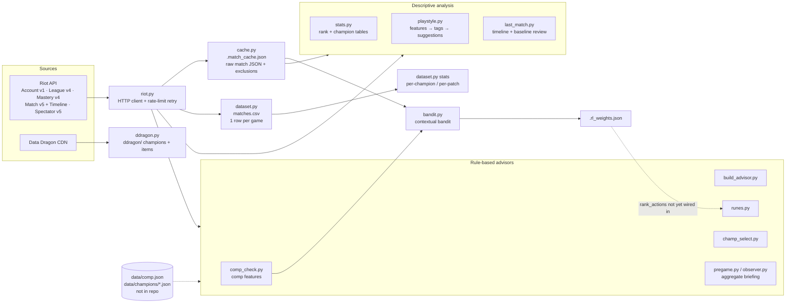
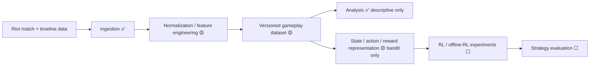

# RiftLab

RiftLab is an experimental project for using data from my own League of Legends ranked games to study decision-making: which pre-game and in-game choices line up with better outcomes, and whether data-driven or learning-based methods can find better strategies than hand-written rules. Right now it's a set of Python CLI tools. They pull match data from the Riot API, build a local dataset of about 1,000 ranked games, compute per-game and per-player features, and produce rule-based analysis. There's also one small learning component: a contextual-bandit prototype for rune selection. It's a research playground, not a finished product.

## Motivation

League of Legends makes you decide under uncertainty all the time: which champion to pick into a given team composition, which runes and items to take, when to fight, and when to stop queuing. Sites like op.gg show aggregate stats, but they don't answer questions about *my* decisions in *my* games.

RiftLab started as a personal stats tracker for two BR accounts. It grew into a place to try out:

- turning raw match data into a dataset I can reason about,
- encoding game knowledge as explicit, testable rules,
- framing a recommendation as a learning problem (context → action → reward) and seeing how far that framing gets with small, noisy, personal data.

**What RiftLab is not:** it's not a bot, and it doesn't play the game or interact with the game client. It only reads data from Riot's public APIs, and every output is text for a human to read. The goal is analysis and experimentation, not automation or an unfair advantage.

## What RiftLab explores

| Area | Status | Where |
|---|---|---|
| Data ingestion from the Riot API (Account, League, Match v5, Timeline, Spectator, Mastery) | **Implemented** | `riot.py`, `cache.py`, `ingest/dataset.py` |
| Local gameplay dataset (CSV) with incremental fetching | **Implemented** | `ingest/dataset.py` → `matches.csv` |
| Static game data snapshot (champions/items, Data Dragon) | **Implemented** (not yet used by the other modules) | `ingest/ddragon.py` → `ddragon/` |
| Per-game feature engineering (KP, damage share, CS/min, death timing, etc.) | **Implemented** | `analysis/playstyle.py`, `analysis/last_match.py`, `ingest/dataset.py` |
| Descriptive analysis (per-champion, per-patch, playstyle tags, baselines) | **Implemented** | `analysis/stats.py`, `analysis/playstyle.py`, `analysis/last_match.py`, `ingest/dataset.py stats` |
| Team-composition representation and rule-based strategy advice | **Implemented, needs data files missing from the repo** (see [Known limitations](#known-limitations)) | `advisors/comp_check.py`, `advisors/build_advisor.py`, `advisors/runes.py`, `advisors/champ_select.py`, `advisors/pregame.py`, `advisors/observer.py` |
| Contextual bandit for rune (keystone) choice | **Prototype**: learns scores, but the scores aren't used for recommendations yet | `rl/bandit.py` |
| Sequential RL (MDP, environment, policy learning) | **Not implemented** (research direction) | — |
| Predictive models / strategy evaluation | **Not implemented** (research direction) | — |

## Architecture

### Current architecture

Everything is one Python package (`src/riftlab/`) of small CLI modules that share one HTTP client (`riot._get`, which retries on HTTP 429). Persistence is plain files: CSV and JSON. There's no database and no service.



Module roles:

- **`riot.py`**: account and region config (from `accounts.json`) and the Riot API wrappers.
- **`paths.py`**: project-root-relative locations for every local file (config, dataset, caches), so the tools behave the same from any directory.
- **`analysis/stats.py`**: rank and per-champion overview.
- **`cache.py`**: caches raw match JSON locally so repeated runs don't hit the API again. Also stores a manual *exclusion* list for games you want to drop from analysis (trolls, AFKs), which is a simple way to handle outliers.
- **`ingest/dataset.py`**: incrementally fetches all available ranked Solo/Duo games per account into `matches.csv`, one row per (match, player).
- **`analysis/playstyle.py`, `analysis/last_match.py`**: feature extraction and descriptive analysis (see below).
- **`advisors/comp_check.py`**: turns a list of five champions into a structured *composition* representation (damage mix, CC count, frontline, assassins, mobility, scaling, win condition). The advisors and the bandit's context build on it.
- **`advisors/build_advisor.py`, `advisors/runes.py`, `advisors/champ_select.py`, `advisors/pregame.py`, `advisors/observer.py`**: hand-written condition → recommendation rules on top of the composition features. `advisors/observer.py` polls the Spectator API and prints phase-specific notes at 5, 14 and 25 minutes.
- **`rl/bandit.py`**: the bandit prototype (see [Reinforcement learning](#reinforcement-learning)).

### Project layout

```text
src/riftlab/
├── riot.py              # Riot API client + account config
├── paths.py             # project-root-relative locations of local files
├── cache.py             # raw match JSON cache + exclusions
├── champion_loader.py   # loads data/ champion knowledge
├── ingest/              # dataset.py (matches.csv), ddragon.py (static data)
├── analysis/            # stats.py, playstyle.py, last_match.py
├── advisors/            # comp_check, build_advisor, runes, champ_select, pregame, observer
└── rl/                  # bandit.py (contextual-bandit prototype)
pyproject.toml, uv.lock  # dependencies, managed with uv
Makefile                 # shortcuts for the common commands
accounts.example.json    # template for the local, gitignored accounts.json
```

Every module can be run with `uv run python -m riftlab.<module>` (e.g. `riftlab.analysis.playstyle main`), and the Makefile wraps the common ones.

### Planned architecture / research direction

This is where the project is headed, **not what exists today**:



✅ implemented · 🟡 partial / prototype · ⬜ not started

## Data / Features

### Sources

- **Riot API** (needs a personal API key): account lookup, ranked entries, champion mastery, match history (queue 420, ranked Solo/Duo), per-match detail, per-match timeline (frame-by-frame events), and live-game spectator data.
- **Data Dragon** (public CDN, no key): champion and item metadata and icons.
- **Hand-authored champion knowledge** (`data/comp.json`, `data/champions/*.json`): per-champion class, damage type, CC, mobility, scaling, win condition, plus rune pages, build conditions, bans and champ-select conditions. *These files aren't in the repository* (see [Known limitations](#known-limitations)).

### Dataset (generated locally, not committed)

`matches.csv` is built by `ingest/dataset.py` and is gitignored, because it contains Riot API data and player IDs, so every user regenerates their own. The snapshot used while writing this README had:

- 1,038 ranked Solo/Duo games (859 on the `lab` account, 179 on `main`), from 2024-10-07 to 2026-04-27, across 127 champions.
- Columns: `match_id, account, puuid, champion, win, kills, deaths, assists, cs, damage, vision, kp, duration_min, timestamp, patch, queue`, plus `double/triple/quadra/penta_kills` on newer rows.
- Games under 5 minutes (remakes) are dropped.

### Features currently extracted

| Level | Features | Code |
|---|---|---|
| Per game (player) | KDA, CS and CS/min, damage to champions, vision score, kill participation, damage share of team, magic/physical damage ratio, gold/min, damage/min, CC time, objective damage, solo kills, "saved ally", first blood, patch | `playstyle.extract_rich`, `dataset._fetch_one` |
| Per game (timeline) | death timestamps bucketed into early (≤14 min), mid (15–24 min) and late game; CS at 10 min | `analysis/last_match.py` |
| Per player (aggregate) | averages of the above, role distribution, champion diversity, win rate, mastery-weighted champion affinity | `playstyle.compute_profile` |
| Personal baseline | average deaths, KP, vision, CS/min and control wards over the last ~10 games; each game is compared against it | `last_match.build_baseline` |
| Recent form | last-5 WR/deaths/KP for you, teammates and opponents; a "tilt" heuristic | `advisors/pregame.py` |
| Team composition | counts of magic/physical/mixed damage, hard/soft CC, frontline, assassins, high-mobility champs, early/late scalers, majority win condition | `comp_check.analyze_comp` |

### Analysis performed

All of it is **descriptive and rule-based**:

- per-champion and per-patch win rate, KDA, CS, damage and multikills (`ingest/dataset.py stats`, `analysis/stats.py`)
- threshold-based playstyle tags (e.g. `carry`, `vision-focused`, `high-risk`) and champion suggestions from tag overlap plus mastery (`analysis/playstyle.py`)
- single-game review against personal baselines, with rule-generated notes (`analysis/last_match.py`)
- rule-based composition matchup insights, build, rune and ban recommendations (`advisors/comp_check.py` and friends)

There's no statistical testing, no train/test split and no predictive model yet.

## Reinforcement learning

This section describes exactly what exists. In short: **there is one contextual-bandit prototype (`rl/bandit.py`). There's no sequential RL environment, no MDP, and no trained policy.**

### Problem framing (as implemented)

"Given my champion and the two team compositions, which keystone rune leads to better outcomes?" That's a single-step decision, so a contextual bandit is the right frame, not full RL.

| Concept | Current implementation |
|---|---|
| **Context / state** | Nine binary flags computed from the composition features: `ap_heavy`, `ad_heavy`, `mixed_dmg`, `cc_heavy`, `late_game`, `has_assassin`, `no_frontline`, `fighting_adc`, `peel_adc`. They're sorted into a string key, and the table is kept separately per champion. The context space is tabular with no generalization: up to 2⁹ contexts per champion. |
| **Action** | The keystone rune **actually used** in the game, read from match data (e.g. `keystone:Electrocute`). The system doesn't choose the action: it logs what the player did. |
| **Reward** | A hand-shaped scalar clipped to [-1, 1]: `+1.0` for a win or `-0.5` for a loss, plus `min(0.3, 0.05 × (baseline_deaths − deaths))`, plus `min(0.2, 0.4 × (KP − baseline_KP))`. The baselines come from the player's last ~10 games. |
| **Environment** | None. Each "step" is one finished ranked game, logged manually with `make feedback-main` (or `python -m riftlab.rl.bandit feedback <account>`). |
| **Learning rule** | Exponential moving average per (champion, context, action): `score ← 0.8·score + 0.2·reward`, initialized at 0. |
| **Policy** | `rank_actions()` sorts candidate actions greedily by score once any of them has ≥ 3 observations, and otherwise keeps the rule-based order. **It isn't called anywhere yet**, so no recommendation currently uses the learned scores. There's no exploration strategy. |
| **Evaluation** | None. |

### Current state of the learned table

`.rl_weights.json` holds **18 logged games across 8 champions and 17 distinct contexts**. No (champion, context, action) triple has reached the 3-observation threshold, so even if the table were wired in it would change nothing. Those numbers are an honest picture of the main obstacle: one player's games spread across hundreds of sparse contexts.

### Known weaknesses of this formulation

- **Off-policy logging without correction.** The actions come from a human's choices, not from the bandit, and nothing corrects for that (no propensities or importance weighting). The scores measure correlation, not causation.
- **Confounding.** Win/loss depends mostly on nine other players. A keystone's score reflects the whole game.
- **EMA from zero.** After one observation the score is 0.2 × reward, so it's biased toward 0 at low *n* and isn't a sample mean.
- **Asymmetric reward shaping.** The death and KP bonuses are capped above but not below, before the final clip.
- **Sparse exact-match contexts.** No sharing across similar contexts or champions.

### Open research questions

These are **not implemented**. They're what I'd investigate next:

- Can champion select be framed as a bandit over *champion pool × composition* using the 1,000-game CSV as offline logged data, and evaluated with off-policy estimators (IPS / doubly-robust)?
- Is there enough signal in the timeline data (gold, XP, positions and events per minute) to define a real MDP for macro decisions like objective timing, where state = game snapshot, action = macro choice, reward = win-probability delta?
- Does a learned win-probability model make a better reward than the hand-shaped one?

## Experiments / Results

**RiftLab has no controlled experiments, benchmarks or evaluated models yet.** The repository contains:

- a dataset builder (`ingest/dataset.py`; the CSV itself is generated locally and not committed),
- the rule-based analyses, whose outputs are per-run terminal reports and aren't saved as experiment artifacts,
- the 18-observation bandit table above, which is too small to draw conclusions from.

To turn this into real experiments, you'd need to measure:

1. **Baseline predictability:** how well simple features (champion, composition flags, patch, recent form) predict win/loss on held-out games, split by time to avoid leakage, compared to a majority-class baseline.
2. **Rule validity:** whether the rule-based advisors' recommendations correlate with outcomes at all, e.g. win rate when the played keystone matched `advisors/runes.py`'s pick vs. when it didn't.
3. **Bandit value:** the off-policy estimated value of a learned keystone policy vs. the logged behavior policy, with confidence intervals.
4. **Reward sensitivity:** whether conclusions change under different reward definitions (win only vs. shaped).

## Running locally

**Requirements:** [uv](https://docs.astral.sh/uv/) (it installs Python 3.12 from `.python-version` if needed) and a Riot API key from [developer.riotgames.com](https://developer.riotgames.com). Development keys expire every 24 hours, so a 401 means you need to regenerate yours.

```bash
make setup                 # uv sync (builds .venv from uv.lock) + copies .env.example → .env
# then edit .env and set RIOT_API_KEY
```

Copy `accounts.example.json` to `accounts.json` and fill in your own Riot IDs (label → Riot ID, platform, routing region). `accounts.json` is gitignored. If it's missing, `ACCOUNT_MAIN` / `ACCOUNT_LAB` from `.env` are used instead.

No Riot data ships with the repository. Build your local copies with `make dataset-fetch` (match dataset) and `make ddragon-fetch` (static champion/item data). The match cache fills itself as the tools run.

### Analysis

```bash
make stats                         # rank overview + last-20 champion stats, all accounts
make profile-main GAMES=40         # playstyle features, tags, insights, champion suggestions
make last-main                     # timeline-based review of the last ranked game vs. baseline

make dataset-fetch                 # incrementally build/extend matches.csv (slow on first run)
uv run python -m riftlab.ingest.dataset stats --account main
make ddragon-fetch                 # refresh Data Dragon snapshot
```

### Rule-based advisors (need `data/`, see below)

```bash
make comp-last-main                # composition analysis of the last game
make pregame-main                  # full briefing, needs a live game
make observe-main                  # pregame + timed phase reports during a live game
make runes-main / make pick-main / make build-live-main
```

### Bandit prototype

```bash
make feedback-main                 # log last game: context, keystone, reward → .rl_weights.json
make rl-weights                    # inspect learned scores
make exclude-main NOTE="afk"       # exclude the last game from analysis
```

### Known limitations

- **`data/` isn't in the repository.** `champion_loader.py` reads `data/comp.json`, `data/aliases.json` and `data/champions/*.json`, but `.gitignore` excludes `data/` and those files were never committed. On a fresh clone every champion resolves as "unknown", so composition features are empty, the advisors return little or nothing, and the bandit context always falls back to `default`.
- `ingest/dataset.py` appends 20-field rows, but a `matches.csv` created before the multikill columns were added keeps its 16-column header. `csv.DictReader` then misreads the multikill counts, so older CSVs need their header rewritten.
- Some static game knowledge (e.g. "Mythic" item slots in `advisors/comp_check.py`) predates recent item-system changes and is out of date.
- There are no tests.

## Project status

**Experimental / research project.**

What works today (given a valid API key):

- data ingestion, local caching, and the incremental CSV dataset
- descriptive per-champion, per-patch and playstyle analysis
- a timeline-based single-game review against personal baselines
- the bandit logging loop (context → action → reward → EMA update)

What's incomplete or still being explored:

- the rule-based advisors depend on untracked knowledge files
- learned bandit scores don't feed back into any recommendation
- no predictive modeling, no sequential RL, no evaluation methodology

## Roadmap

In the order the current code suggests:

1. **Make it reproducible.** Commit (or generate) the `data/` knowledge files, fix the CSV header, and add tests for the pure functions (`analyze_comp`, `build_state`, `compute_reward`, `eval_build_condition`).
2. **Strengthen the dataset.** Store richer per-game rows (role, full team and enemy compositions, keystone, items, timeline-derived features such as CS@10, gold diff @15 and death timings) so that analyses and learning can run offline from the CSV instead of live API calls.
3. **Establish baselines.** Build a time-split win-prediction baseline, e.g. logistic regression on composition and form features, so later methods have something to beat.
4. **Test the rules.** Measure whether the rule-based recommendations actually correlate with outcomes in historical games.
5. **Offline contextual bandit.** Replay historical games as logged bandit data for keystone and champion choice, evaluate with off-policy estimators, and only then wire `rank_actions()` into `advisors/runes.py` / `advisors/champ_select.py`.
6. **Explore sequential decisions.** Use Match v5 timelines to define a state/action/reward representation for macro decisions and check whether offline RL is feasible with this amount of data.
7. **Reproducible experiments.** Fixed dataset snapshots, seeded runs, and results saved as artifacts rather than terminal output.

`IDEAS.md` has the older feature backlog.

## Lessons / engineering notes

- **Problem formulation beats algorithm choice.** Picking a rune is a one-shot decision whose payoff comes at the end of the game, so a contextual bandit fits better than full RL. Writing the bandit made it obvious that the hard parts are the *context* definition and the *reward*, not the update rule.
- **Personal data is small and non-stationary.** About 1,000 games spread over 127 champions and many patches means most (champion, context) cells are empty. Any learning approach here needs pooling, generalization across similar contexts, or offline data from many players.
- **Outcome ≠ decision quality.** A win is a very noisy signal for one player's choice in a 10-player game. The shaped reward (deaths and KP relative to a personal baseline) tries to reduce that noise, but it also bakes in assumptions that need to be tested.
- **Data quality issues creep in quietly.** An exclusion list for troll games, a remake filter (< 5 min), a schema change that broke the CSV header, and knowledge files that never got committed are all cases where the analysis would have been silently wrong.
- **Knowledge as data.** Moving champion knowledge from Python dicts into JSON files with a small condition DSL (`champion_loader.eval_build_condition`) made the rules inspectable and editable. Those files being untracked shows why data needs versioning just like code.
- **API constraints shape the design.** Dev-key rate limits (20 req/s, 100 req/2 min) led to the local match cache and the incremental CSV. Match v5 only goes back about two years, which caps how much history a dataset can have.

## Legal

RiftLab isn't endorsed by Riot Games and doesn't reflect the views or opinions of Riot Games or anyone officially involved in producing or managing Riot Games properties. Riot Games and all associated properties are trademarks or registered trademarks of Riot Games, Inc.

No license file has been added yet, so all rights are reserved by default.
